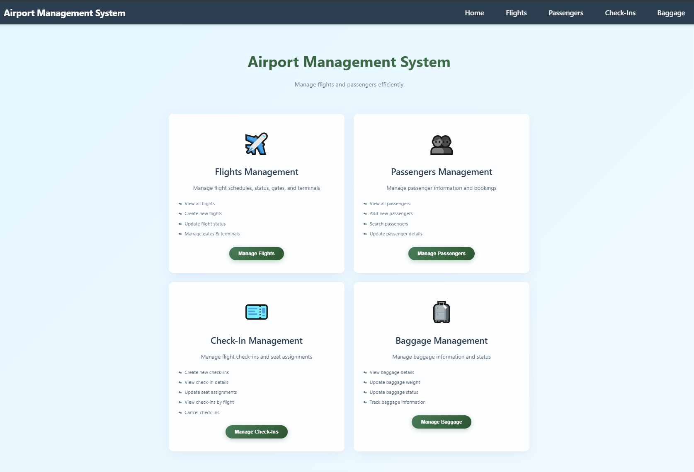
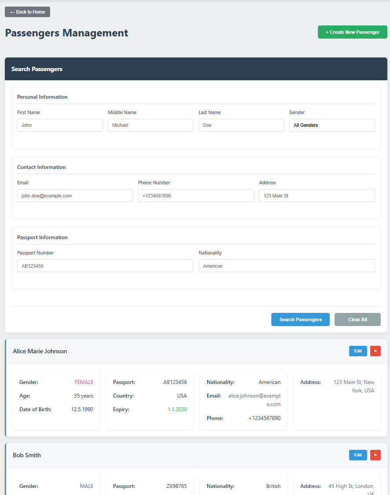
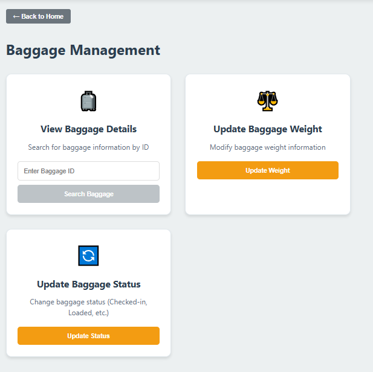
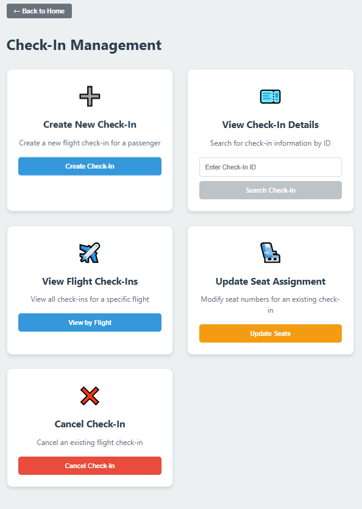

[# Project Setup ans Run Guide

This project uses Docker Compose to run multiple services (frontend, backend microservices, and NGINX as a reverse
proxy)

Follow the instructions below to start, stop, and manage the entire environment.

## Requirements

Before running the application, make sure you have installed:

* Docker
* Docker Compose

to verify installation:

  ```
  docker --version
  docker compose version
  ```

## Starting the Application

You can start everything in two ways:

### 1. Using the helper script (docker.sh)

#### Start all Services

  ```
  ./docker.sh up
  ```

#### Stop all Services

  ```
  ./docker.sh up
  ```

#### Delete all containers, networks and volumes

⚠️ Warning: This removes all persisted data!

  ```
  ./docker.sh up
  ```

The script internally runs commands define in docker-compose.yaml and behaves as follows:

  ```
  docker-compose -f docker-compose.yaml up -d
  docker-compose -f docker-compose.yaml down -v
  docker-compose -f docker-compose.yaml down -v --remove-orphans
  ```

### 2. Using Docker Compose directly

#### Start Services

  ```
  docker compose -f docker-compose.yaml up -d
  ```

#### Stop all Services

  ```
 docker compose -f docker-compose.yaml down -v
  ```

### 🌐 Accessing the Application

When all services are running, open:

  ```
 http://localhost
  ```

NGINX will route requests to the appropriate microservices according to the configuration defined in nginx.conf.
For example:

* /flights → flight-scheduler-service:8080
* /passengers → passenger-checkin-service:8080
* /baggage → passenger-checkin-service:8080
* /checkins → passenger-checkin-service:8080]

These routes are specified in NGINX config: `nginx.conf`

### Below are example screenshots of the system UI.

---
#### 🏠 Home Page

---

#### ✈️ Flights Management


---

#### 👤 Passengers Management


---

#### 🧳 Baggage Management


---

#### 🪪 Check-In Management
